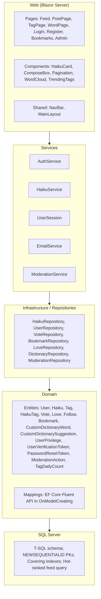
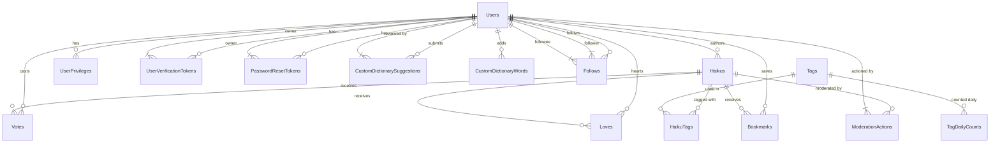
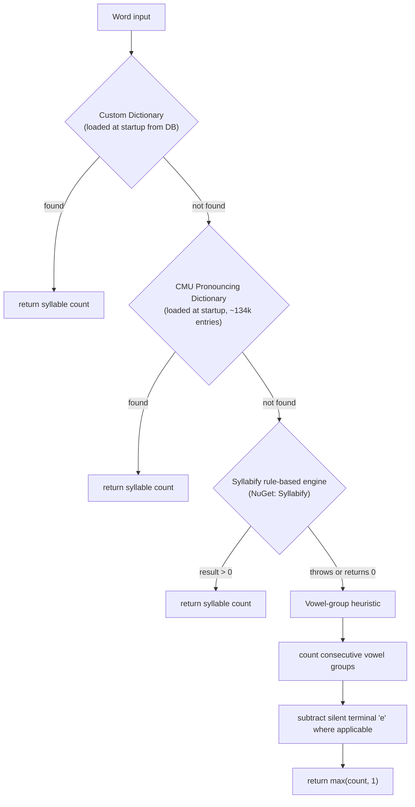

# Haiku — Product Requirements Document

**Version:** 1.1
**Status:** Draft
**Last Updated:** June 2026
**Owner:** Product Team

---

## Table of Contents

1. [Overview](#1-overview)
2. [Problem Statement](#2-problem-statement)
3. [Goals and Non-Goals](#3-goals-and-non-goals)
4. [User Personas](#4-user-personas)
5. [Functional Requirements](#5-functional-requirements)
6. [Non-Functional Requirements](#6-non-functional-requirements)
7. [User Stories](#7-user-stories)
8. [Technical Architecture](#8-technical-architecture)
9. [Database Schema](#9-database-schema)
10. [Component Inventory](#10-component-inventory)
11. [Feature Prioritisation](#11-feature-prioritization)
12. [Success Metrics](#12-success-metrics)
13. [Out of Scope](#13-out-of-scope)
14. [Open Questions](#14-open-questions)
15. [Appendix](#15-appendix)

### Addendum

1. [UI & Styling Addendum](prd.UiStylingAddendum.md)

---

## 1. Overview

Haiku is a web-based social platform for composing, sharing, and discovering messages in the form of haiku and related poetry structures. It follows the interaction model of short-form social media (Twitter/X, Mastodon) while being purpose-built for the constraints of syllable-structured messages.

"Poems" include multiple forms — despite the name "haiku" they are not explicitly haikus. The platform auto-detects the poem type at creation time and validates syllable counts accordingly.

The platform validates syllable counts in real time during composition and stores the validated count with the poem. Every word renders as a navigable link, and the community surfaces quality content through thumbs-up / thumbs-down voting and a "loved" heart toggle.

Users are referred to as "Poet" / "Poets" in the UI.

### 1.1 Elevator Pitch

> A Twitter-like feed where every post is a haiku or short "poem" message. Words and hashtags are hyperlinked across the corpus, building an emergent web of thematic connection between poems and poets.

### 1.2 Scope of This Document

This PRD covers the v1.0 release of Haiku: the core compose-share-discover loop, user accounts, voting, bookmarking, loves, word/tag navigation, algorithmic feed ranking, trending hashtags, word cloud, moderation tools, custom dictionary workflow, and password/verification email support. Future features are noted but not specified in detail.

---

## 2. Problem Statement

### 2.1 The Opportunity

Haiku has a large, active community of practitioners and readers, but no dedicated social platform exists for it. Poets currently fragment across general platforms (Twitter, Instagram, Reddit) where:

- There is no syllable validation — most "haiku" posted online do not follow the form.
- Discovery is keyword-search only; there is no thematic linking between poems.
- Voting and curation are generic (likes) with no signal about literary quality or structural correctness.
  - Voting may only be done via authenticated users.
  - A user may not vote on a poem more than once, though they may change their vote or abandon their vote.
- The visual presentation treats poetry like prose microblogging.
- The intention is for fun and sharing; this will not be a "serious" poetry web application, and it encourages users to share and browse existing user-created poetry.

### 2.2 The Problem We Solve

| Pain Point | Haiku Solution |
|---|---|
| No structural enforcement | Live syllable counter; publish blocked if invalid |
| No thematic discovery | Every word links to haikus sharing that word |
| Fragmented community | Dedicated feed, author profiles, follows |
| Generic presentation | Typography designed for the poem structure |
| No quality signal | Thumbs up/down with aggregate score + loves per haiku |

---

## 3. Goals and Non-Goals

### 3.1 Goals

**G1 — Composition** Make it frictionless to compose and publish a structurally valid poem (haiku, tanka, monoku, and other accepted forms) with real-time per-line syllable feedback. Poem type is auto-detected; freeform is available as an explicit opt-in.

**G2 — Discovery** Allow readers to traverse the corpus via words, hashtags, and authors without requiring, but allowing, explicit search. A Hot-ranked feed surfaces quality content algorithmically.

**G3 — Community** Give the community a lightweight curation mechanism (thumbs up/down voting, loves) that surfaces quality content.

**G4 — Identity** Allow poets to build an author profile and body of work that is their permanent, linkable presence on the platform.

**G5 — Trust** Protect accounts with properly hashed passwords. Enforce email uniqueness. Verify emails on registration. Prevent vote manipulation.

**G6 — Friendly Fun Environment** Allow readers and poets to have a smooth friendly environment to read, create, and discover poetry.

### 3.2 Non-Goals (v1.0)

- Real-time notifications (push or in-app) — deferred to v1.1.
- Mobile native apps (iOS/Android) — web-responsive only for now.
- Monetization, subscriptions, or ads.
- Image or audio attachment to haikus.
- Direct messaging between users.
- Automated moderation or content filtering.
- Internationalization beyond English syllable counting.
- OAuth / social login (Google, GitHub, etc.) — email+password only.

---

## 4. User Personas

A user may be one or more personas.

### 4.1 Poet

**Background:** Writes poems.
**Goals:** Build an audience for their work and share their poetry.
**Frustrations:** Tired of explaining haiku form in the comments. Suggests custom dictionary words with syllable count. Wants validation that their syllable counts are right. Wants their body of work in one place.
**Key flows:** Compose → Publish → View profile → Follow other poets.

### 4.2 The Casual Reader

**Background:** Enjoys poetry but does not write regularly. Discovers Haiku through social sharing or browsing the site.
**Goals:** Browse beautiful short poems. Curate favorites. Follow poets whose work resonates.
**Frustrations:** Does not want to create an account just to read. Wants to understand what makes a haiku good.
**Key flows:** Browse feed (unauthenticated) → Register to vote/love/bookmark → Follow an author.

### 4.3 The Explorer

**Background:** Enjoys the connections between things. Clicks on words and hashtags to see where they lead.
**Goals:** Discover unexpected thematic links. Find all poems about rain, silence, or a specific season.
**Frustrations:** Tag-only navigation misses untagged thematic content.
**Key flows:** Read a poem → Click a word → Browse word-filtered feed → Click another word.

### 4.4 Administrator

**Background:** Manages the site, handles issues, has access to backend configuration, ejecting users, viewing logs, statistics, errors, exceptions. Grants specific additional privileges to users. Adds and modifies the custom dictionary.
**Goals:** Maintain the site and keep things moving smoothly.
**Frustrations:** Dealing with "bad" users, handling disputes.
**Privileges:** All privileges (manage_dictionary, moderate_users, moderate_poems, view_logs).

### 4.5 Moderator

**Background:** Blessed users, by the Administrator, that have been given special access to the system via the UserPrivileges table.
**Goals:** Disable user accounts, reset passwords. Approve/reject custom dictionary word suggestions. Hide poems. Flag poems as NSFW / spam / copyright concerns.
**Frustrations:** Managing spam, handling ill-intentioned users.
**Privileges:** Subset granted by Administrator (moderate_poems, moderate_users, manage_dictionary).

---

## 5. Functional Requirements

Requirements are tagged **MH** (must-have, v1.0), **SH** (should-have, v1.1), or **NH** (nice-to-have, future).

### 5.1 Account Management

| ID | Requirement | Priority |
|---|---|---|
| AM-01 | Users can register with a unique email address and a unique username. | MH |
| AM-02 | Passwords must be at least 8 characters and are stored as BCrypt hashes (work factor ≥ 12). | MH |
| AM-03 | Users can log in with email and password. A persistent secure session cookie is issued on login. | MH |
| AM-04 | Login attempts for a non-existent email run through the same BCrypt verification path to prevent timing attacks. | MH |
| AM-05 | Users can log out, terminating their session and clearing the session cookie. | MH |
| AM-06 | Users can update their markdown bio and display name. | SH |
| AM-07 | Users may use a gravatar or equivalent image service for their profile; the profile image URL is stored on the Users record. | MH |
| AM-08 | Users can delete their account. At deletion time they choose: (a) soft-delete with poems anonymized and attributed to "[deleted]", votes/bookmarks preserved; or (b) hard-delete with all poems and associated votes/bookmarks removed. | MH |
| AM-09 | *(reserved)* | |
| AM-10 | Email verification on registration. A verification email with a one-time token (1-hour expiry) is sent. Unverified accounts may read the feed but cannot publish poems or vote. | MH |
| AM-11 | Password reset via email link with a one-time token (1-hour expiry). | MH |
| AM-12 | A "Sessions" page lists all active sessions for the user, showing device/browser info, IP address, and last active timestamp. Each session can be individually revoked. Backed by a `UserSessions` table with a series+token security stamp pattern. | MH |
| AM-13 | Revoking a session invalidates its auth cookie immediately; the user must re-authenticate on that device. | MH |
| AM-14 | A GDPR cookie consent banner is shown on a user's first visit. It explains the use of the authentication cookie and any non-essential cookies, and includes a dismiss action. The banner is dismissable and must meet key requirements for cookie consent messaging. | MH |
| AM-15 | **(Future)** A "Log out of all devices" option invalidates all sessions for the user (triggered by password change). | NH |
| AM-16 | **(Future)** OAuth 2.0 / social login is supported via configurable providers (Google, GitHub, and others TBD). OAuth accounts are linked to an existing email-and-password account on first login if the email matches, or create a new account. A user may link multiple OAuth providers to the same account. | NH |
| AM-17 | **(Future)** Automatic profile image resolution via Gravatar (using the user's email hash) or equivalent provider. If no Gravatar match is found, a generated identicon or initials-based avatar is shown as fallback. The user may override with a custom URL. | NH |

### 5.2 Poem Composition

| ID | Requirement | Priority |
|---|---|---|
| HC-01 | Authenticated users can compose a poem in a single text input field. Lines are delimited by newline control characters. The UI may render each line in its own visual row. | MH |
| HC-02 | The composer displays a live syllable count per line that updates on every keystroke. Each line has an inline syllable badge positioned to its right showing `{actual}/{target}` when the poem type is detected/known, or `{actual}` alone for freeform. The counts are computed client-side for responsiveness and validated server-side on publish. | MH |
| HC-03 | Each line's syllable count badge is green when it hits its target, amber when in progress, and red when over the target. The target is only displayed when the poem type is inferred or explicitly known. | MH |
| HC-04 | The "Publish" action is blocked with a validation error if any line's syllable count does not match the target for the detected poem type. Freeform poems skip validation. | MH |
| HC-05 | Users can save a poem as a draft without syllable validation. | MH |
| HC-06 | Drafts are private and visible only to the author. | MH |
| HC-07 | Users can publish a draft (subject to validation). | MH |
| HC-08 | Users can delete their own published poems. | MH |
| HC-09 | Hashtags (`#word`) within poem lines are detected automatically and stored as normalized tags. | MH |
| HC-10 | The composer provides a "Generate" button that produces a random poem using the CMU dictionary. Generated poems may be nonsensical; they must satisfy the syllable constraints of the selected poem type (including freeform). | MH |
| HC-11 | The system attempts to guess the poem type based on line count and syllable structure at creation time. If the input does not match any known pattern it defaults to Freeform. The user may override the detected type. | MH |
| HC-12 | Users may explicitly select "Freeform" mode to bypass syllable validation for non-standard structures. This must be an intentional opt-in via the UI. | MH |
| HC-13 | On publish, the validated syllable counts, poem type, and total syllable count are persisted with the poem record. | MH |
| HC-14 | A dedicated "My Drafts" page (`/drafts`) displays a paginated list of all the user's unpublished drafts, newest first. Each draft shows its preview text and has Publish and Delete actions. | MH |
| HC-15 | A badge on the NavBar or composer area shows the count of unpublished drafts when the user has one or more drafts saved. | MH |
| HC-16 | Users can delete a draft from the drafts page without publishing it. | MH |
| HC-17 | The composer displays a count line below the input area showing character count, total syllable count, word count, and line count in that order. Format: `{chars} chars · {syl} syl · {words} words · {lines} lines` in monospace type. Updates are debounced at 800ms on keystroke and 50ms on paste. | MH |
| HC-18 | The composer layout from top to bottom: (1) single textarea with per-line syllable badges, (2) poem type badge + Freeform toggle row, (3) count display line (chars · syl · words · lines), (4) theme picker chip row, (5) action bar. | MH |
| HC-19 | The composer is hidden entirely for unauthenticated users. | MH |

### 5.3 Syllable Counting Engine

| ID | Requirement | Priority |
|---|---|---|
| SC-01 | Syllable counting uses a multi-tier resolution chain: Custom dictionary → CMU Pronouncing Dictionary → Syllabify rule engine → vowel-group heuristic. | MH |
| SC-02 | Each tier is attempted in order; the first successful result terminates the chain. | MH |
| SC-03 | The CMU dictionary is loaded once at application startup and cached in memory. It is bundled as an embedded resource. | MH |
| SC-04 | There exists a custom dictionary table where words, their syllable count, the user that added/suggested them, and modification timestamps are stored. Words are case-insensitive. Admin may add/remove directly; users may submit suggestions with a justification. A privileged user approves or rejects each suggestion. | MH |
| SC-05 | Individual letters should be syllable-counted as the number of syllables as the spoken letter. | MH |
| SC-06a | Numerals and numbers should be syllable-counted as their spoken word equivalent. The Humanizer library is used to convert numerals to their spoken English form (e.g., 100 → "one hundred", 15 → "fifteen", -3 → "negative three"). | MH |
| SC-06b | Roman numerals, when capitalised as a single string of greater than one character that are obviously non-words, should be treated as numerals. | SH |
| SC-07 | Words not found in any tier default to a minimum of 1 syllable. | MH |
| SC-08 | The engine exposes a diagnostic mode that returns the syllable count and the resolution tier for each word, visible to all users but hidden by default. | SH |
| SC-09 | Syllable validation is performed at creation/publish time. The validated counts are persisted on the poem record and are not re-computed on read. | MH |
| SC-10 | Non-spoken characters (em dashes, en dashes, hyphens, punctuation marks, emoji, and other non-alphabetic glyphs) do not count toward syllable count and are not counted as words. They are preserved in the poem content for display but excluded from all counting logic. | MH |
| SC-11 | Word count for the composer display is defined as whitespace-delimited tokens meeting any of: (a) one or more consecutive alphabetical characters, (b) one or more consecutive numeral digits, or (c) an uppercase Roman numeral sequence. The line count counts only non-empty lines (lines containing at least one qualifying word token). | MH |

### 5.4 Feed and Discovery

| ID | Requirement | Priority |
|---|---|---|
| FD-01 | The main feed displays all published poems ranked by a Reddit-style "Hot" algorithm (log10 of net score decayed by age), paginated at 10 per page. | MH |
| FD-02 | The feed is accessible to unauthenticated users (read-only). | MH |
| FD-03 | Author names in the feed link to the author's profile page. | MH |
| FD-04 | Author profile pages display all published poems, count of poems, total loves, total votes, paginated newest-first. | MH |
| FD-05 | Every word in every rendered poem line is a hyperlink to a word-filtered feed. | MH |
| FD-06 | Hashtags link to a tag-filtered feed. | MH |
| FD-07 | Tag-filtered and word-filtered feeds are paginated at 10 per page, Hot-ranked. | MH |
| FD-08 | Authenticated users see a personalized feed showing only followed authors. | SH |
| FD-09 | A trending hashtags sidebar shows the top tags by usage in the last 24 hours, sourced from a daily aggregation table. | SH |
| FD-10 | A user may view the list of poems they have loved. Public profiles show the list of poems loved by that user. | SH |
| FD-11 | The main feed sidebar displays a word cloud showing the most common words across all published poems. Each word links to the word-filtered feed. | SH |

### 5.5 Voting and Loves

| ID | Requirement | Priority |
|---|---|---|
| V-01 | Authenticated users can cast a thumbs-up (+1) or thumbs-down (-1) vote on any published poem. | MH |
| V-02 | Authenticated users may "love" / un-love a poem via a heart toggle. Loves are public and appear on the author's profile. | MH |
| V-03 | Each user may cast at most one vote per poem (enforced at the database level). | MH |
| V-04 | Voting the same direction a second time removes the vote (toggle). | MH |
| V-05 | Voting the opposite direction from an existing vote replaces it (flip). | MH |
| V-06 | The poem card displays the total thumbs-up count, thumbs-down count, and net score. The net score is prefixed with `+` for positive or `-` for negative values. | MH |
| V-07 | The net score is colored green for positive, red for negative, and neutral for zero. A `+` / `-` prefix is also shown to avoid relying solely on color. | MH |
| V-08 | The current user's active vote is visually indicated: the button becomes a filled/solid style with a background glow/highlight. The same treatment applies to the heart/love toggle when active. | MH |
| V-09 | Unauthenticated users see vote counts and loves but cannot vote or love; the buttons are disabled with a contextual tooltip: "Log in to vote", "Log in to love this poem", "Log in to bookmark" per button. | MH |
| V-10 | Casting a thumbs-up or thumbs-down vote triggers a micro-bounce/pop animation on the icon (scale to 1.2x and back, ≈200ms). Plays on activation (toggle on) only. | MH |
| V-11 | Toggling the heart/love button triggers a single 360° spin animation on the icon (custom CSS keyframe, ≈400ms). Plays on activation (toggle on) only. | MH |
| V-12 | Toggling the bookmark triggers a micro-bounce/pop animation (same as V-10). Plays on activation (toggle on) only. | MH |
| V-13 | When a vote is cast, the score number briefly pulses/scales up with a green or red color flash matching the vote direction, then settles to its resting color. | MH |
| V-14 | All interactive micro-animations (V-10 through V-13) respect `prefers-reduced-motion: reduce` — icons snap to their active/inactive state instantly with no animation. | MH |
| V-15 | Vote, love, and bookmark buttons carry dynamic `aria-label` attributes that update based on toggle state: "Upvote poem" / "Remove upvote", "Love this poem" / "Remove love", "Bookmark poem" / "Remove bookmark". | MH |

### 5.6 Bookmarks

| ID | Requirement | Priority |
|---|---|---|
| BM-01 | Authenticated users can bookmark any published poem. | MH |
| BM-02 | Bookmarking the same poem a second time removes the bookmark (toggle). | MH |
| BM-03 | Bookmarks are private to the user — never exposed on profiles or feeds. | MH |
| BM-04 | A dedicated "Bookmarks" page shows all of the user's saved poems. | SH |
| BM-05 | Toggling a bookmark triggers a micro-bounce/pop animation on the bookmark icon on activation. | MH |

### 5.7 Social Graph

| ID | Requirement | Priority |
|---|---|---|
| SG-01 | Authenticated users can follow another user. | SH |
| SG-02 | Authenticated users can unfollow a user they currently follow. | SH |
| SG-03 | A user's profile shows their follower and following counts. | SH |
| SG-04 | Users cannot follow themselves (enforced at DB level). | SH |

### 5.8 Moderation

| ID | Requirement | Priority |
|---|---|---|
| MOD-01 | Privileged users (with `moderate_poems` privilege) can hide any published poem. Hidden poems are excluded from all feeds and searches. A record is written to the ModerationActions table. | MH |
| MOD-02 | Privileged users (with `moderate_users` privilege) can disable any user account. Disabled accounts cannot log in or publish. | MH |
| MOD-03 | Privileged users (with `moderate_users` privilege) can reinstate a disabled account. | MH |
| MOD-04 | All moderation actions are recorded in the ModerationActions table with timestamp, actor, target, action type, and reason. | MH |
| MOD-05 | Privilege grants and revocations are recorded in the UserPrivileges table. | MH |
| MOD-06 | Any authenticated user can report any published poem via a "Report" button on the `HaikuCard`. Submitting a report creates a record in a `Reports` table viewable in the moderation queue. The report button is hidden entirely for unauthenticated users. | MH |
| MOD-07 | The report reason picker offers: Spam, NSFW (Not Safe For Work), Copyright infringement, and Other (with a free-text details field). | MH |
| MOD-08 | Privileged users with `moderate_poems` privilege see a moderation queue page (`/moderation/queue`) listing unreviewed reports grouped by poem. For each report, the moderator may Hide the poem or Dismiss the report. A record is written to `ModerationActions` on hide. | MH |

### 5.9 Custom Dictionary Workflow

| ID | Requirement | Priority |
|---|---|---|
| CD-01 | The CustomDictionaryWords table stores approved words with their syllable count. Words are case-insensitive. | MH |
| CD-02 | An administrator or moderator with `manage_dictionary` privilege can add, edit, or remove words directly in the custom dictionary. | MH |
| CD-03 | A poet may submit a word suggestion via the CustomDictionarySuggestions table, including the word, suggested syllable count, and a justification (up to 200 characters, nullable). | MH |
| CD-04 | A privileged user can approve or reject each suggestion. On approval, the word is copied to CustomDictionaryWords. | MH |
| CD-05 | The custom dictionary is loaded at application startup and cached in memory alongside the CMU dictionary. | MH |

### 5.10 REST API

| ID | Requirement | Priority |
|---|---|---|
| API-01 | An internal REST API exists for administration and tooling. It is not documented for or supported for third-party use. | MH |
| API-02 | API endpoints are rate-limited: 30 requests per minute for unauthenticated IPs, 60 requests per minute for authenticated sessions. | MH |

### 5.11 Development & Testing Configuration

| ID | Requirement | Priority |
|---|---|---|
| DEV-01 | An `IEmailSender` interface abstracts email delivery with implementations for SMTP (production), console logging (development), and in-memory capture (testing). | MH |
| DEV-02 | An `Email:RequireVerification` app setting controls whether email verification is enforced. When `false`, accounts are auto-verified on registration; verification tokens are still generated for audit purposes. Default: `true` in production, `false` in development. | MH |
| DEV-03 | Development configuration (`appsettings.Development.json`) disables email verification and HTTPS-only cookie requirements to allow local HTTP testing. | MH |
| DEV-04 | Password reset emails follow the same `IEmailSender` abstraction. In development, reset links are printed to the console so developers can copy-paste them. | MH |
| DEV-05 | Unit and integration tests use `FakeEmailSender` which captures sent emails in memory for assertion. No SMTP dependency in test projects. | MH |
| DEV-06 | A user impersonation feature is available in the development environment only. It is gated by both `IWebHostEnvironment.IsDevelopment()` and a `DevTools:EnableImpersonation` config key (default `false`). If either condition is false, the impersonation middleware is completely inert — no override is applied regardless of request input. | MH |
| DEV-07 | The admin page provides a searchable user picker (by username or email) to initiate impersonation. Selecting a user sets a server-side override so all subsequent requests within that session behave as that user. The picker lists all active users; disabled/deleted users are excluded. | MH |
| DEV-08 | A "View as Anonymous" toggle is available alongside the user picker. When active, the developer browses the feed with no authenticated user — exactly as an unauthenticated visitor would see it. This does not require selecting a real DB user. | MH |
| DEV-09 | Impersonation defaults to read-only (browse feed, view profiles, see bookmarks/loves). Write operations (publish, vote, love, bookmark) are blocked with a clear "Write actions are disabled in impersonation mode" message. A `DevTools:ImpersonationAllowWrites` config flag can override this to full read-write when needed for targeted testing. | MH |
| DEV-10 | When impersonation is active, a prominent amber banner is displayed at the top of every page: "Impersonating as @username — [Stop Impersonating]". A one-click "Stop Impersonating" button clears the override immediately and restores the developer's own session. | MH |

**Critical guard:** The impersonation middleware must be structurally impossible to enable in non-development environments. The `DevTools:EnableImpersonation` key must never appear in `appsettings.json` (production defaults) or any environment-specific config outside `appsettings.Development.json`. The `IsDevelopment()` runtime check provides a secondary defense layer. Quality assurance and staging environments must not have this feature available.

### 5.12 Discovery Search

| ID | Requirement | Priority |
|---|---|---|
| SR-01 | A search bar is displayed on the main feed page. Search results are shown on a dedicated search results page at the route `/search?q={query}`. | MH |
| SR-02 | Search covers poem content, author username and display name, and tags — all matched case-insensitively. | MH |
| SR-03 | Results are ranked in the following priority order: (1) explicit hashtag matches, (2) poem content matches, (3) author matches. Within each tier, results are ordered by Hot score. | MH |
| SR-04 | Matching search terms are highlighted in result snippets. | MH |
| SR-05 | A stop words list is maintained in a `StopWords` table. The table is bootstrapped via `seed-data.sql` with approximately 100–150 common English stop words. Words on this list are excluded from search indexing and results. An additional static in-memory list serves as the primary filter, with the DB table as the secondary, admin-maintainable source. A NuGet library providing standard English stop words may also be referenced. | MH |
| SR-06 | Stop words and single characters cannot be used as hashtags or word-link anchors. If a user types `#the` or `#a`, it is treated as plain text and not linked. | MH |
| SR-07 | Search is accessible to unauthenticated users with the same functionality. | MH |
| SR-08 | **(Future)** Stop words list management UI for privileged users (add/remove words without a deploy). | SH |

### 5.13 Onboarding

| ID | Requirement | Priority |
|---|---|---|
| ON-01 | After successful registration (and email verification, or auto-verification in development), a first-time user is shown an onboarding flow once. | MH |
| ON-02 | The onboarding page displays: (a) a poetic welcome message, (b) a selection of popular poets to follow, and (c) a curation of popular recent poems to browse. | MH |
| ON-03 | The user is prompted to optionally set their profile bio. The bio must satisfy a recognized poem structure (validated like any poem on publish). The user may skip this step. | MH |
| ON-04 | The user may dismiss the onboarding flow at any point and proceed to the main feed. The onboarding is not shown again. | MH |

### 5.14 Poem Reprocessing (Future)

| ID | Requirement | Priority |
|---|---|---|
| RP-01 | An author may trigger reprocessing of their own published poems, either individually or in bulk (all their published poems). Reprocessing re-runs poem type detection and syllable validation against the current engine and updates the persisted `PoemType`, per-line syllable counts, and `TotalSyllables` on the poem record. | NH |
| RP-02 | Reprocessing does not apply to draft poems. Drafts are already re-processed automatically on publish (at which point the current engine state is used). | NH |
| RP-03 | An administrator may trigger reprocessing of: (a) an individual poem, (b) all poems by a given user, or (c) all poems in the system. | NH |
| RP-04 | Reprocessing is an asynchronous operation. The user or administrator is notified when reprocessing completes (in-app or via the UI). Progress feedback is provided for bulk operations. | NH |
| RP-05 | No vote scores, loves, bookmarks, moderation state, or other metadata is altered by reprocessing. Only the poem's type and syllable data are updated. | NH |
| RP-06 | A record of the reprocessing action is logged (who triggered it, scope, timestamp) for audit purposes. | NH |

### 5.15 Error Handling and Feedback

| ID | Requirement | Priority |
|---|---|---|
| EH-01 | When a user hits a rate limit (HTTP 429), a clear message is displayed indicating that they have been rate-limited and specifying the cooldown period. This applies to both API and page requests. | MH |
| EH-02 | All form submissions display per-field validation messages for each invalid input, inline next to the relevant field. | MH |
| EH-03 | Continue and improve the existing `Status.razor` pattern (haiku-themed error pages) — ensure coverage for all HTTP status codes surfaced by the `UseStatusCodePagesWithReExecute` middleware, including 400, 403, 404, 429, and 500. Each error page must include a "Return Home" link. | MH |

---

## 6. Non-Functional Requirements

### 6.1 Performance

| ID | Requirement |
|---|---|
| P-01 | Feed page load (first contentful paint) must complete in < 1 second on a standard broadband connection. |
| P-02 | Syllable counting for a single poem line must complete in < 50 ms. |
| P-03 | Vote cast and score refresh must complete in < 500 ms from user action. |
| P-04 | The application must support 200 concurrent Blazor Server SignalR circuits without degradation. |

### 6.2 Security

| ID | Requirement |
|---|---|
| S-01 | All passwords stored as BCrypt hashes with work factor ≥ 12. Plaintext never persisted. |
| S-02 | Login timing is constant-time regardless of whether the email exists (BCrypt dummy hash on miss). |
| S-03 | All HTTP traffic served over HTTPS (HSTS enforced in production). Development config may relax this for local testing. |
| S-04 | Blazor antiforgery tokens enabled on all forms. |
| S-05 | User input is HTML-encoded by Blazor's default renderer; no raw HTML injection paths exist. |
| S-06 | The one-vote-per-user constraint is enforced at the SQL UNIQUE constraint level, not solely in application code. |
| S-07 | Rate limiting at 30 req/min for unauthenticated IPs, 60 req/min for authenticated sessions, enforced at middleware level. |

### 6.3 Reliability

| ID | Requirement |
|---|---|
| R-01 | The application targets 99.5% monthly uptime. |
| R-02 | Database schema migrations use EF Core migrations (`dotnet ef migrations add` + `dotnet ef database update`). |
| R-03 | EF Core `DbContext` lifecycle is scoped to the HTTP request; contexts are never shared across requests. |
| R-04 | Application logging via structured logger (e.g. Serilog). |
| R-05 | StackExchange.Exceptional database exception logging. |

### 6.4 Accessibility

| ID | Requirement |
|---|---|
| A-01 | All interactive elements are keyboard-navigable with visible focus indicators. |
| A-02 | Vote, love, and bookmark buttons carry dynamic `aria-label` attributes that update based on toggle state. |
| A-03 | Loading states use ARIA `role="status"` on spinner elements. |
| A-04 | Colour alone is not used to convey meaning (score direction is also indicated by `+` / `-` prefix). |
| A-05 | A11y-compliant user interface (WCAG 2.1 AA target). |
| A-06 | All micro-animations (vote pop, heart spin, score pulse) are disabled when `prefers-reduced-motion: reduce` is detected. Icons and scores snap to their active/inactive state instantly. |

### 6.5 Visual Aspects

| ID | Requirement |
|---|---|
| VIS-01 | Clean unobtrusive UI targeting simple elegance over clutter. |
| VIS-02 | Mobile and desktop friendly responsive design. |
| VIS-03 | Light mode and dark mode support. |

### 6.6 REST API

| ID | Requirement |
|---|---|
| API-01 | Internal REST API exposes CRUD operations for administration tooling (poems, users, dictionary, moderation). |
| API-02 | API is rate-limited at 30 req/min unauthenticated, 60 req/min authenticated. |

### 6.7 Internationalization

The v1.0 syllable engine targets English only. The architecture does not preclude adding language-specific engines in future via the three-tier pattern, but no i18n investment is planned for v1.0.

---

## 7. User Stories

### Compose and Publish

> **As a poet,** I want a live syllable counter on each line while I type, so that I know my poem is valid before I try to publish it.

> **As a poet,** I want to save a poem as a draft so that I can return and polish it before publishing.

> **As a poet,** I want to use `#hashtags` inline in my lines so that my poem appears in relevant tag feeds without extra steps.

> **As a poet,** I want the platform to auto-detect whether I'm writing a haiku, tanka, monoku, or freeform, so I don't have to select a type manually.

> **As a poet,** I want a generate button that creates a random poem, so I can get inspiration or have fun with nonsensical output.

### Discover

> **As a reader,** I want the feed to show the hottest poems first (by vote score and recency), so I see what the community is enjoying right now.

> **As a reader,** I want to click any word in a poem and see all other poems containing that word, so that I can explore thematic threads organically.

> **As a reader,** I want to visit a poet's profile and see only their poems, so that I can follow a voice I like.

> **As a word explorer,** I want hashtag pages to show all poems tagged that way, so that I can follow a seasonal or thematic thread.

> **As a reader,** I want a word cloud sidebar showing the most common words across all poems, so I can discover popular themes at a glance.

### Vote and Curate

> **As a reader,** I want to give a thumbs-up to a poem I find beautiful so that the poet receives recognition and the poem rises in the community's view.

> **As a reader,** I want to be able to flip my vote from thumbs-up to thumbs-down if I change my mind, so that I am not locked into my first reaction.

> **As a reader,** I want to see the net score of a poem so that I can quickly gauge community sentiment.

> **As a reader,** I want to "heart" a poem that I especially liked, with my loves visible on my profile.

### Accounts

> **As a new user,** I want to register with my email address and verify it, so that my account is tied to a unique identity I control.

> **As a returning user,** I want to log in once and stay logged in across page refreshes, so that I do not need to log in on every visit.

> **As a user,** I want to bookmark poems privately so that I can build a personal anthology without it being visible to others.

> **As a user,** I want to delete my account and choose whether my poems stay (anonymised) or go.

### Moderation

> **As a moderator,** I want to hide inappropriate poems and disable problematic accounts, so that the community stays welcoming.

> **As a moderator,** I want to approve or reject custom dictionary word suggestions, so that the syllable engine stays accurate.

### Reprocessing

> **As a poet,** I want to reprocess my published poems so that they reflect the latest poem type detection and syllable counting logic.

> **As an administrator,** I want to reprocess all poems in the system so that engine improvements are applied retroactively without requiring authors to act individually.

### Development

> **As a developer,** I want to run the app locally without an email server, with verification bypassed and emails logged to the console, so I can iterate quickly.

> **As a developer,** I want tests that capture sent emails in memory for assertion, so I can verify email flows without SMTP dependencies.

---

## 8. Technical Architecture

### 8.1 Technology Decisions

| Concern | Choice | Rationale |
|---|---|---|
| UI framework | Blazor Server (.NET 10) | Full C# stack; no JS build pipeline; real-time interactivity via SignalR |
| UI components | Bootstrap 5 + custom CSS | Widely understood; easy to override; no licensing concerns |
| UI Glyphs | Free tier of FontAwesome for imagery | |
| ORM | Entity Framework Core 10.x | Full-featured ORM; LINQ provider; Fluent API + DataAnnotations; mature SQL Server support |
| Database | SQL Server (T-SQL) | Requirement; NEWSEQUENTIALID reduces index fragmentation vs random Guid |
| Password hashing | BCrypt.Net-Next (work=12) | Industry standard; ≈300 ms per hash on modern hardware; resistant to GPU attacks |
| Syllable counting | Custom dictionary → CMU dict → Syllabify → vowel-group | Tiered for accuracy vs coverage; CMU highest accuracy for known English words |
| Architecture | Vertical Stack Architecture | Easy to maintain with specific UI, Business Logic, Service, and Repository layers per domain |
| Containerization | Docker containers | Makes handling deployment and testing easier |
| CI/CD | GitHub CI/CD | Best practice for potential open source projects |
| Libraries | Humanizer, CMU dictionary, FluentValidation, xUnit, NSubstitute | Common good practice tool use |
| Session | Secure auth cookie (ASP.NET Core Cookie Authentication) | Persistent sessions across page refreshes |
| Email | `IEmailSender` interface with SMTP/Console/Fake implementations | Testable; no email server dependency in dev |

### 8.2 Layer Diagram



### 8.3 Session and Auth Model

Haiku uses ASP.NET Core Cookie Authentication for persistent sessions.

- On login, a secure cookie is issued with configurable expiry (default: 7 days). The cookie is HTTPS-only in production; the secure flag is relaxed in development.
- `UserSession` is a scoped service per Blazor Server SignalR circuit, populated from the auth cookie on circuit start.
- On logout, the cookie is cleared and the circuit session is invalidated.
- Development configuration (`appsettings.Development.json`) sets `Cookie.Secure = false` and `Cookie.SameSite = Lax` to allow local HTTP testing.

### 8.4 Email Architecture

Email is abstracted behind `IEmailSender`:

```csharp
public interface IEmailSender
{
    Task SendEmailAsync(string to, string subject, string body);
}
```

| Implementation | Environment | Behavior |
|---|---|---|
| `SmtpEmailSender` | Production | Sends via configured SMTP server |
| `ConsoleEmailSender` | Development | Logs subject, body, and recipient to `ILogger` (developer sees links in stdout) |
| `FakeEmailSender` | Testing | Captures sent emails in an in-memory `List<EmailMessage>` for assertion |

Configuration:

```json
// appsettings.json (production default)
{
  "Email": {
    "RequireVerification": true,
    "Sender": { "Provider": "Smtp" }
  }
}

// appsettings.Development.json (overrides)
{
  "Email": {
    "RequireVerification": false,
    "Sender": { "Provider": "Console" }
  }
}
```

When `RequireVerification = false`:

- Registration auto-verifies the user (`EmailVerifiedAt` set immediately).
- Verification tokens are still generated and stored (for audit).
- Email-sending calls go to `ConsoleEmailSender` — the developer sees the verification/reset link in the console log.

### 8.5 Syllable Engine Integration

The `HaikuService` orchestrates syllable validation at creation time.

- The CMU dictionary and custom dictionary are loaded at application startup and cached in memory.
- On publish, each line's syllable count is computed via the resolution chain (SC-01) and validated against the detected poem type.
- The validated PoemType, per-line syllable counts, and total syllable count are persisted on the Haiku record.
- On read, the persisted syllable data is displayed — the engine is not re-invoked.
- The full three-tier engine (`HaikuEngine.cs`) is a single-class drop-in; the `CountWordSyllables` call in `HaikuService` is the only integration point.

### 8.6 Vote Score and Hot Ranking

The vote score for a poem is **never stored as a column**. It is always computed as `SUM(Votes.Value)` over the vote rows for that poem. This avoids update-anomaly bugs where the stored count drifts from actual vote rows.

The Hot ranking score is computed per-query using the Reddit-style formula:

```
HotScore = log10(max(|net_score|, 1)) + sign(net_score) * seconds_since_epoch / 45000
```

Where `seconds_since_epoch` is the poem's `CreatedAt` timestamp. This computation happens in the database query (T-SQL) and the result is used to order the feed. No background job is required.

### 8.7 Poem Type Detection

On creation, the system analyzes the input to determine the poem type:

1. Strip trailing/leading whitespace and split on newlines.
2. Count lines.
3. Check each line's syllable count against known patterns (5-7-5, 3-5-3, 2-3-2, 4-6-4, equal-line, 5-7-5-7-7, 1-17 one-line).
4. If a pattern matches → set PoemType accordingly.
5. If no pattern matches → default to Freeform.
6. User may override the detected type before publishing.

---

## 9. Database Schema

### 9.1 Entity-Relationship Overview



### 9.2 Table Summary

#### Modified Tables

| Table | PK Type | Columns Added / Changed | Constraints | Notes |
|---|---|---|---|---|
| `Users` | `UNIQUEIDENTIFIER` | Add: `IsDisabled BIT`, `DeletedAt DATETIME2 NULL`, `DeletionChoice VARCHAR(10) NULL`, `EmailVerifiedAt DATETIME2 NULL`, `ProfileImageUrl NVARCHAR(500) NULL` | `UNIQUE(Email)`, `UNIQUE(Username)` | `DeletionChoice`: `'Anonymize'` or `'Remove'` |
| `Haikus` | `UNIQUEIDENTIFIER` | Replace `Line1, Line2, Line3` with `Content NVARCHAR(500)`. Add: `PoemType VARCHAR(20)`, `TotalSyllables INT`, `IsHidden BIT NOT NULL DEFAULT 0`, `DeletedAt DATETIME2 NULL` | FK → Users | Indexed on `(CreatedAt DESC)` filtered `IsDraft=0 AND IsHidden=0 AND DeletedAt IS NULL`; Hot score computed in query |

#### Existing Tables (unchanged)

| Table | PK Type | Key Constraints | Notes |
|---|---|---|---|
| `Tags` | `INT IDENTITY` | `UNIQUE(Name)` | Name stored lowercase, no `#` prefix |
| `HaikuTags` | Composite `(HaikuId, TagId)` | FK → Haikus, Tags | Junction table; indexed on `TagId` |
| `Votes` | `UNIQUEIDENTIFIER` | `UNIQUE(HaikuId, UserId)`, `CHECK(Value IN (1,-1))` | Constraint prevents duplicate votes at DB level |
| `Follows` | `UNIQUEIDENTIFIER` | `UNIQUE(FollowerId, FolloweeId)`, `CHECK(FollowerId <> FolloweeId)` | Self-join; self-follow blocked at DB level |
| `Bookmarks` | `UNIQUEIDENTIFIER` | `UNIQUE(UserId, HaikuId)` | Private; not exposed in public queries |

#### New Tables

| Table | PK Type | Columns | Constraints | Notes |
|---|---|---|---|---|
| `Loves` | `UNIQUEIDENTIFIER` | `HaikuId FK`, `UserId FK`, `CreatedAt DATETIME2` | `UNIQUE(HaikuId, UserId)` | Public: visible on profiles |
| `CustomDictionaryWords` | `UNIQUEIDENTIFIER` | `Word NVARCHAR(200)`, `SyllableCount INT`, `AddedByUserId FK`, `AddedAt DATETIME2`, `IsApproved BIT` | `UNIQUE(Word)` (case-insensitive) | Loaded into memory at startup |
| `CustomDictionarySuggestions` | `UNIQUEIDENTIFIER` | `Word NVARCHAR(200)`, `SuggestedSyllableCount INT`, `SuggestedByUserId FK`, `Justification NVARCHAR(200) NULL`, `ReviewedByUserId FK NULL`, `ReviewedAt DATETIME2 NULL`, `Status VARCHAR(20)` | | Status: `Pending`, `Approved`, `Rejected` |
| `UserPrivileges` | `UNIQUEIDENTIFIER` | `UserId FK`, `Privilege VARCHAR(50)`, `GrantedByUserId FK`, `GrantedAt DATETIME2` | `UNIQUE(UserId, Privilege)` | Privilege names: `moderate_poems`, `moderate_users`, `manage_dictionary`, `view_logs` |
| `UserVerificationTokens` | `UNIQUEIDENTIFIER` | `UserId FK`, `Token VARCHAR(128)`, `CreatedAt DATETIME2`, `ExpiresAt DATETIME2`, `UsedAt DATETIME2 NULL` | Index on `Token` | One-time; expires 1 hour after creation |
| `PasswordResetTokens` | `UNIQUEIDENTIFIER` | `UserId FK`, `Token VARCHAR(128)`, `CreatedAt DATETIME2`, `ExpiresAt DATETIME2`, `UsedAt DATETIME2 NULL` | Index on `Token` | One-time; expires 1 hour after creation |
| `ModerationActions` | `UNIQUEIDENTIFIER` | `ActionType VARCHAR(50)`, `TargetType VARCHAR(20)`, `TargetId UNIQUEIDENTIFIER`, `ActionedByUserId FK`, `Reason NVARCHAR(500)`, `CreatedAt DATETIME2` | | `ActionType`: `Hide`, `Unhide`, `Disable`, `Reinstate` |
| `TagDailyCounts` | Composite `(TagId, Date)` | `TagId FK`, `Date DATE`, `Count INT` | `PK(TagId, Date)` | Updated nightly; feeds trending sidebar |
| `UserSessions` | `UNIQUEIDENTIFIER` | `UserId FK`, `SeriesToken VARCHAR(128)`, `DeviceInfo NVARCHAR(500)`, `IpAddress VARCHAR(45)`, `LastActiveAt DATETIME2`, `CreatedAt DATETIME2` | `UNIQUE(SeriesToken)`, FK → Users | Supports per-session revocation; series+token security stamp |
| `Reports` | `UNIQUEIDENTIFIER` | `HaikuId FK`, `ReportedByUserId FK`, `Reason VARCHAR(20)`, `Details NVARCHAR(1000) NULL`, `Status VARCHAR(20)`, `ReviewedByUserId FK NULL`, `ReviewedAt DATETIME2 NULL`, `CreatedAt DATETIME2` | FK → Haikus, Users | Status: `Pending`, `Dismissed`, `Actioned`; feeds moderation queue |
| `StopWords` | `UNIQUEIDENTIFIER` | `Word NVARCHAR(100)`, `AddedByUserId FK`, `AddedAt DATETIME2` | `UNIQUE(Word)` | Case-insensitive; seeded via `seed-data.sql`; admin-maintainable |

### 9.3 Indexing Strategy

| Index | Purpose |
|---|---|
| `IX_Haikus_CreatedAt` (filtered: `IsDraft=0 AND IsHidden=0 AND DeletedAt IS NULL`) | Main feed — Hot-ranked, excludes drafts, hidden, and deleted |
| `IX_Haikus_Author_CreatedAt` | Author profile page — all poems by author, newest first |
| `IX_HaikuTags_TagId` | Tag page — all poems for a given tag |
| `IX_Votes_HaikuId` | Score computation — aggregate votes per poem |
| `IX_Loves_HaikuId` | Love count per poem |
| `IX_TagDailyCounts_Date_Count` | Trending hashtags — top tags by date |
| `IX_CustomDictionaryWords_Word` | Dictionary lookup — case-insensitive word search |
| `IX_UserSessions_UserId` | Session lookup — all sessions for a user |
| `IX_Reports_Status` | Moderation queue — unreviewed reports |
| `IX_StopWords_Word` | Search — stop word exclusion lookup |

---

## 10. Component Inventory

### 10.1 Pages

| Route | Component | Description |
|---|---|---|
| `/` | `Feed.razor` | Main Hot-ranked feed; compose box for authenticated users; trending sidebar; word cloud sidebar |
| `/poet/{authorId}` | `PoetPage.razor` | Author profile with their poem feed, follower/following counts, loves |
| `/tag/{tagName}` | `TagPage.razor` | Poems filtered by hashtag |
| `/word/{word}` | `WordPage.razor` | Poems containing a specific word |
| `/login` | `LoginPage.razor` | Email + password login form |
| `/register` | `RegisterPage.razor` | Registration form with password confirmation |
| `/bookmarks` | `BookmarksPage.razor` | User's private bookmarks |
| `/loves` | `LovesPage.razor` | User's loved poems |
| `/admin` | `AdminPage.razor` | Admin dashboard (moderation, dictionary, logs) |
| `/search` | `SearchPage.razor` | Search results for poem content, authors, and tags; ranked by hashtag > content > author |
| `/drafts` | `DraftsPage.razor` | Paginated list of user's drafts with publish/delete actions |
| `/sessions` | `SessionsPage.razor` | Active sessions list with per-session revoke |
| `/onboarding` | `OnboardingPage.razor` | Post-registration welcome flow (shown once) |
| `/moderation/queue` | `ModerationQueue.razor` | Moderation queue of unreviewed reports |

### 10.2 Reusable Components

| Component | Responsibility |
|---|---|
| `HaikuCard` | Renders one poem with vote buttons, word links, tag badges, love toggle, bookmark toggle |
| `ComposeBox` | Single-textarea composer with live per-line syllable counters, poem type detection badge, generate button, publish/draft actions |
| `Pagination` | Page number strip with prev/next; accepts a `PagedResult<T>` and an `OnPageChange` callback |
| `NavBar` | Top navigation; shows username/sign-out when authenticated, login/register otherwise |
| `MainLayout` | Wraps `NavBar` and a `<main>` container; included by all pages |
| `WordCloud` | Sidebar widget showing top N words by frequency, each linking to word-filtered feed |
| `TrendingTags` | Sidebar widget showing top tags from the last 24 hours, each linking to tag-filtered feed |
| `SearchBar` | Search input with results dropdown; navigates to `/search?q=...` on submit |
| `ReportButton` | Flag icon on `HaikuCard`; opens a reason picker modal (Spam, NSFW, Copyright, Other) |
| `CookieConsentBanner` | Dismissable GDPR cookie consent banner shown on first visit |

### 10.3 Services (DI-registered)

| Service | Lifetime | Responsibility |
|---|---|---|
| `HaikuDbContext` | Scoped | EF Core `DbContext`; provides entity DbSets per HTTP request |
| `HaikuRepository` | Scoped | Poem CRUD, paginated queries, tag attachment, Hot-ranked feed query |
| `UserRepository` | Scoped | User lookup, existence checks, creation, deletion |
| `VoteRepository` | Scoped | Vote upsert with toggle/flip logic |
| `LoveRepository` | Scoped | Love toggle, user/public love list queries |
| `BookmarkRepository` | Scoped | Bookmark toggle, user bookmark list |
| `UserSession` | Scoped | Per-circuit auth state (Blazor Server), populated from auth cookie |
| `AuthService` | Scoped | Registration, login, BCrypt, cookie issue/clear |
| `EmailService` | Scoped | Dispatches email through configured `IEmailSender` |
| `HaikuService` | Scoped | Business rules, syllable counting, poem type detection, tag extraction, word tokenisation |
| `DictionaryService` | Scoped | Custom dictionary CRUD, suggestion workflow, in-memory cache refresh |
| `ModerationService` | Scoped | Hide/unhide poems, disable/reinstate users, audit logging, report triage |
| `SearchService` | Scoped | Full-text search across poems, authors, and tags; stop word filtering; result ranking |
| `SessionService` | Scoped | Session listing, revocation, series+token management |

---

## 11. Feature Prioritization

### 11.1 v1.0 — Launch

- User registration and authentication with persistent session cookie
- Email verification on registration (configurable; stubbed in dev)
- Password reset via email link (stubbed in dev)
- Compose, validate, detect poem type, and publish poems
- Draft save
- Hot-ranked main feed (Reddit-style algorithm)
- Author profile pages with loves count
- Word-link navigation
- Hashtag navigation and trending sidebar
- Thumbs-up / thumbs-down voting with score
- "Loved" poem marking (public, profile-visible)
- Bookmarks with permalinks (private)
- Word cloud sidebar
- Bootstrap 5 UI with light/dark mode
- Custom dictionary (admin CRUD + user suggestion workflow)
- Minimal moderation (hide poems, disable users) with privilege system
- Internal admin REST API
- Development mode: email verification bypass, console email logger, relaxed cookie security
- Draft management page with unpublished count badge
- Content reporting (report button + moderation queue)
- Discovery search with stop words, case-insensitive matching, hashtag-ranked results
- Onboarding flow (poetic welcome, suggested poets, popular poems, optional poem-structured bio)
- Session management page with per-session revocation
- GDPR cookie consent banner
- Haiku-themed error pages for all HTTP status codes (400, 403, 404, 429, 500)
- Rate-limit feedback UI
- Per-field validation messages on all forms

### 11.2 v1.1 — Community

| Feature | Effort | Business Value |
|---|---|---|
| Personalized feed (followed authors) | Low | High — core social feature |
| Follow / unfollow | Low | High — enables personalized feed |
| Profile edit (bio, avatar) | Low | Medium |
| Push notifications | Medium | Medium |

### 11.3 v1.2 — Discovery and Quality

| Feature | Effort | Business Value |
|---|---|---|
| Haiku generator (CMU-backed) | Low (engine exists) | Medium — onboarding hook |
| Kigo (season word) tagging | Low | Medium — serves traditional haiku community |
| @mentions with notifications | Medium | High — social engagement |
| Admin dashboard improvements | Medium | Medium |
| Analytics dashboard for authors (views, vote history) | Medium | Medium |
| Stop words management UI for privileged users | Low (DB exists) | Medium |

### 11.4 Future Consideration

- OAuth 2.0 social login (Google, GitHub, etc.) with account linking to existing email+password accounts
- Profile image provider integration (Gravatar hash resolution, automatic identicon/initials fallback, custom URL override)
- Mobile apps (React Native or MAUI)
- Verified poet badge
- International syllable engines (Japanese, French)
- Haiku contests / challenges
- Public third-party API
- Moderator draft access
- Poem editing within a grace window
- SEO / server-side rendering for poem detail pages
- User blocking (block/unblock other users; blocked user's poems hidden from feed, cannot follow, votes hidden)
- "Log out of all devices" option (bulk session revocation via password change)
- Poem collections / anthologies — users can create named, shareable collections (e.g. "Autumn Poems") and add any published poem to them; each collection has a permalink
- Scheduled / delayed publishing — set a future `PublishAt` timestamp on a draft; system publishes automatically (to be considered — not committed to any version)
- RSS / Atom feeds — machine-readable feeds for the main Hot feed, tag pages, word pages, and author profiles (to be considered — not committed to any version)
- Bulk poem export — authenticated users may export their own published poems as JSON, including permalink, poem type, per-line syllable counts, total syllables, tags, love count, net vote score, and published timestamp. Export of other authors' poems is not permitted (to be considered — not committed to any version)
- Poem reprocessing — authors and administrators may re-run poem type detection and syllable validation on published poems. Authors can reprocess their own poems individually or in bulk; administrators can reprocess a single poem, all poems by a user, or all poems system-wide. Drafts are excluded — they are automatically re-processed on publish.

---

## 12. Success Metrics

### 12.1 Acquisition

| Metric | v1.0 Target (90 days post-launch) |
|---|---|
| Registered users | 500 |
| Monthly active users (MAU) | 200 |
| D7 retention | ≥ 25% |

### 12.2 Engagement

| Metric | Target |
|---|---|
| Poems published per active user per month | ≥ 3 |
| % of poems with at least one vote | ≥ 40% |
| % of sessions including a word/tag navigation click | ≥ 30% |
| Average session duration | ≥ 4 minutes |

### 12.3 Quality

| Metric | Target |
|---|---|
| % of published poems that pass syllable validation | 100% (enforced for non-freeform) |
| p95 feed page load time | < 800 ms |
| Uptime | ≥ 99.5% monthly |

### 12.4 Leading Indicators

The primary leading indicator for platform health is **word-link and hashtag click-through rate**. If the interconnected corpus is generating organic browsing sessions, the discovery model is working. A rate below 20% of sessions including at least one navigation click would trigger a UX review.

---

## 13. Out of Scope

The following are explicitly excluded from v1.0 and should not be built without a separate PRD:

- **Direct messaging** between users.
- **Image or audio attachments** to poems.
- **Email notifications** of any kind beyond verification and password reset.
- **Real-time feed updates** (the feed requires a manual refresh or page navigation to show new posts).
- **Poem editing** after publishing (delete and repost is the intended flow for v1.0).
- **Automated spam or abuse detection** beyond manual moderation (hide/disable).
- **SEO / server-side rendering** for poem detail pages (Blazor Server provides this incidentally, but it is not a design target).
- **Analytics dashboard** for authors (view counts, vote history over time).
- **Third-party public API**.

---

## 14. Open Questions

| # | Question | Owner | Status |
|---|---|---|---|
| OQ-01 | Should the feed be accessible to unauthenticated users, or require registration? | Product | **Decided:** Public read-only (FD-02) |
| OQ-02 | Should vote scores affect feed ordering, or is recency-only correct for v1.0? | Product | **Decided:** Reddit-style Hot ranking |
| OQ-03 | What happens to poems and votes when a user deletes their account? Hard delete vs soft delete vs anonymisation? | Product / Eng | **Decided:** User chooses at deletion time |
| OQ-04 | Should the syllable engine be strict (block invalid poems) or advisory (warn but allow)? | Product | **Decided:** Strict for publish, advisory for drafts, freeform bypasses |
| OQ-05 | Is session loss on page refresh acceptable at launch? | Product / Eng | **Decided:** Persistent auth cookie shipped in v1.0 |
| OQ-06 | What is the rate limit for posting? | Product | **Decided:** 30 req/min unauthenticated, 60 req/min authenticated |
| OQ-07 | Should the CMU dictionary file be bundled or loaded from a configurable path? | Engineering | **Decided:** Bundled as embedded resource |
| OQ-08 | Should deleted poems show as `[deleted]` in word/tag feeds or be fully removed? | Product | **Decided:** Fully removed |
| OQ-09 | What is the word cloud refresh strategy — real-time, periodic cache rebuild, or materialized view? | Engineering | Open |
| OQ-10 | Should the daily TagDailyCounts aggregation run as a scheduled job (SQL Agent, Hangfire) or on-demand? | Engineering | Open |
| OQ-11 | What is the expiry duration for the persistent auth cookie? | Product / Eng | Open |
| OQ-12 | Should Hot feed ranking use a fixed decay constant or should it be configurable? | Engineering | Open |
| OQ-13 | How are stop words maintained for search? | Product / Eng | **Decided:** Static bootstrap + DB table (`StopWords`) + NuGet library reference; seed via `seed-data.sql`; admin-maintainable |
| OQ-14 | How are search results ranked? | Product | **Decided:** Hashtag match > poem content match > author match, then Hot score within tiers |
| OQ-15 | Should users have visibility and control over active sessions? | Product / Eng | **Decided:** Sessions page with per-session revoke in v1.0; bulk logout via password change in future |
| OQ-16 | Should v1.0 include a user-facing content reporting flow or rely on manual moderator discovery? | Product | **Decided:** User-facing report button + moderation queue in v1.0 |

---

## 15. Appendix

### 15.1 Poem Structures Recognized

| Pattern | Name | Notes | Must Pass Syllable Validation |
|---|---|---|---|
| 5-7-5 | Traditional haiku | Canonical form; the only structure that passes the publish validator | true |
| 1 to 17 | Monoku | One-line poem emphasising flow and ambiguity | true |
| 5-7-5-7-7 | Tanka | 5-line classical form | true |
| 3-5-3 | Minimalist | 3-line short form | true |
| 2-3-2 | Compressed | 3-line ultra-short form | true |
| 4-6-4 | Near-traditional | Common in translations | true |
| n-n-n | Equal-line | Modern variant; each line same syllable count | true |
| Freeform | Freeform | 1-5 lines, under 150 words total. Must be explicitly chosen by the user | false |

**Poem type detection rules:**

1. Split content by newline characters → obtain line count.
2. If line count is 1 and total syllables ≤ 17 → Monoku.
3. If line count is 3 → attempt to match: 5-7-5, 3-5-3, 2-3-2, 4-6-4, equal-line.
4. If line count is 5 → attempt to match: 5-7-5-7-7.
5. If line count is 1-5 and n-ary equal-line pattern matches n-n-n.
6. If no pattern matches → default to Freeform.
7. User may override the detected type via the UI.

### 15.2 Syllable Resolution Chain



### 15.3 Hot Ranking Algorithm

The Hot score is computed per-query and never stored:

```sql
HotScore = LOG10(ABS(ISNULL(SUM(v.Value), 0)) + 1)
         + SIGN(ISNULL(SUM(v.Value), 0))
         * DATEDIFF(SECOND, '2025-01-01', h.CreatedAt) / 45000.0
```

This formula:

- Uses `LOG10` of absolute net score (plus 1 for zero-score posts to avoid `-infinity`).
- Adds the age component in seconds divided by 45,000 (12.5 hours), scaled by the sign of the score.
- New posts with positive votes rank highest; older posts and negatively scored posts decay.

### 15.4 Glossary

| Term | Definition |
|---|---|
| **HaikuDbContext** | The EF Core `DbContext` scoped to a single HTTP request / Blazor circuit |
| **Circuit** | A Blazor Server SignalR connection between browser and server; one per open browser tab |
| **EF Core migrations** | Code-first schema evolution via `dotnet ef migrations add` and `dotnet ef database update` |
| **Word token** | A single whitespace-delimited word in a poem line, annotated with whether it is an explicit hashtag |
| **Hot score** | Reddit-style ranking score combining net vote count and age; computed per-query |
| **Poem type** | The structural form of a poem (haiku, tanka, monoku, freeform, etc.) auto-detected at creation |
| **IEmailSender** | Abstraction for sending emails with implementations for SMTP (production), console (development), and in-memory capture (testing) |
